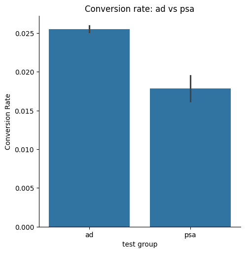
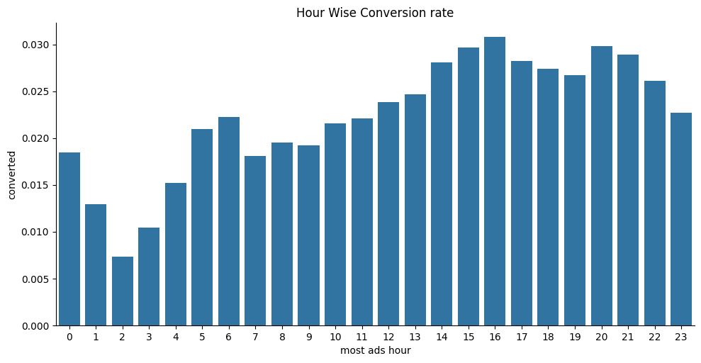
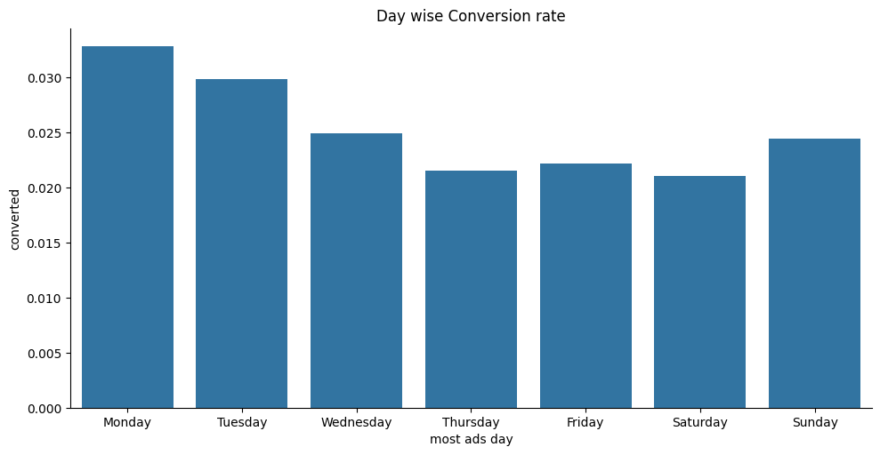

# Marketing Campaign A/B Testing Analysis

 **Analytics Requirement Document (ARD):**  
Defines the business context, stakeholder questions, and initial exploratory analysis performed before the final report and recommendations.
 [View ARD (Google Sheets)](https://docs.google.com/spreadsheets/d/13TjVEB9KXNQ7kbYN8L4q4sEpdWbEXun5BLAmjinXuBA/edit?usp=sharing)

---

## Project Background

An online platform wanted to understand whether showing users **advertisements** increases product conversions.

Users were randomly split into two groups:

- **Ad Group** – users saw advertisements  
- **PSA Group** – users saw a Public Service Announcement (PSA), which acts as a neutral control message  

The goal of the experiment was to determine whether advertisements lead to a **higher conversion rate**.

---

## Dataset Overview

The dataset contains **~580,000 user observations** from a marketing campaign experiment.

Each record includes:

- **user_id** – unique user identifier  
- **test_group** – ad (treatment) or psa (control)  
- **converted** – whether the user purchased the product  
- **total_ads** – number of ads shown to the user  
- **most_ads_day** – day with highest ad exposure  
- **most_ads_hour** – hour with highest ad exposure  

---

## Key Experiment Result

The experiment compares the conversion rate between users who saw advertisements and users who saw a PSA message.

- The **Ad group conversion rate is about 2.56%**.  
- The **PSA group conversion rate is about 1.79%**.  
- Users who saw advertisements were **more likely to purchase the product**.

This initial comparison suggests that showing ads may improve user conversions.

---

## Statistical Validation

To confirm whether the observed difference is meaningful, a statistical test was performed.

- An **Independent Two Sample t-test** was used to compare conversion rates between the two groups.
- The test result shows that the difference between the Ad group and PSA group is **statistically significant**.
- This indicates that the higher conversion rate in the Ad group is **unlikely to be caused by random chance**.

**Technical note:**  
The statistical test produced a **p-value below 0.05**, which is a common threshold used to determine statistical significance in experiments.

---

## Business Impact

To understand the practical impact of the experiment, the improvement in conversion rate was calculated.

- The Ad group achieved **about 43% higher conversion rate compared to the PSA group**.
- This indicates that advertisements have a **strong positive impact on user conversions**.
- Even small improvements in conversion rate can lead to **significant revenue growth when applied to large user bases**.

---

## Supporting Behavioral Insights

### Hour-wise Conversion Rate

Key observations:

- Conversion rates vary across different hours of the day.
- The highest conversion rates appear during the **afternoon and evening hours (around 14:00 – 20:00)**.
- Early morning hours show **lower conversion rates**.

This suggests that **ad timing may influence user engagement and purchasing behavior**.

---

### Day-wise Conversion Rate

Key observations:

- Conversion rates vary slightly across days of the week.
- **Monday and Tuesday show the highest conversion rates**.
- **Weekend days such as Saturday show relatively lower conversions**.

This may indicate that users are **more likely to make purchasing decisions during the beginning of the week**.

---

## Final Recommendation

Based on the experiment results:

- Showing advertisements leads to **higher user conversion rates compared to PSA messages**.
- The improvement is **statistically significant and unlikely to be caused by random variation**.
- The Ad group achieved **about 43% higher conversion rate** than the control group.
- The business should **continue using advertisements instead of PSA messages** for this campaign.
- Future experiments could test **optimal ad timing, ad frequency, and different ad creatives** to further improve conversion rates.
